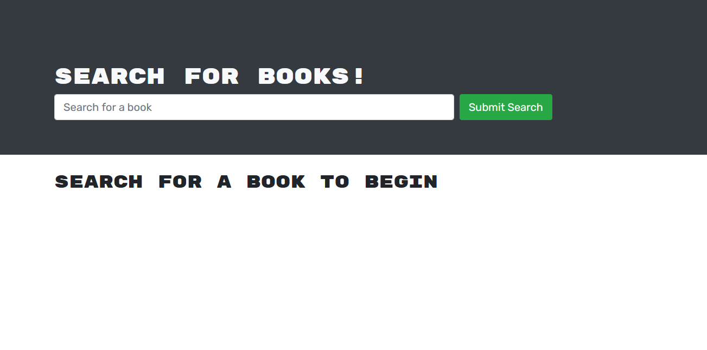

# GraphQL-Redo
This project involved taking a Full Stack Restful website and refactoring it to use GraphQL.  It was interesting looking at an entire website and deciphering what parts went where and mapping out the import chaining.  One issue I have was figuring out the authorization.  I had alot of troubles with that and looking into the documentation was troubling.  I am not completely sure if my method was correct. 

# Table of Contents
- [Link](#Link)
- [Landing](#landing-Page)
- [License](#license)
- [Questions](#questions)

# Link

[Website](https://shielded-mountain-32132.herokuapp.com/)

# Landing-Page

# License

This project is covered under the MIT License.

Additional information can be obtained in the About Section.

# Questions
  
Want to check out more of my work?  Check me out at my github [profile](https://github.com/PhilipHuang2).
  
Have any questions?
  
Feel free to email me at Philiphuang2@gmail.com.